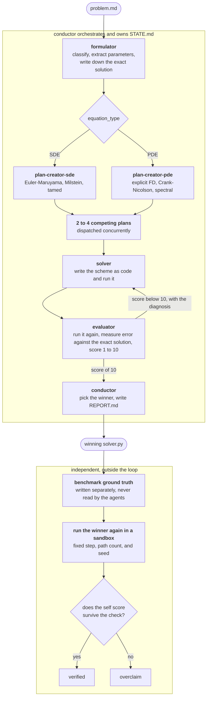

# Autonumerics

Describe a differential equation in plain English. Get back a numerical solver that has been checked against the real answer.

Autonumerics is a Claude Code plugin. Seven agents and an orchestrator read a problem statement, design several competing numerical schemes, implement and test each one in parallel, and return the one with the lowest measured error.

## The problem it addresses

Numerical solvers are easy to write and hard to trust. A scheme can run without errors, produce a smooth plot, and still be wrong, because it quietly violated a stability condition or stopped enforcing a boundary condition after the first time step. The failure is silent. You only catch it if you compare against something you already know.

So the pipeline never accepts a solver on the strength of it running. Every candidate is scored against the exact solution, and a plan is only finished when its measured error clears a real threshold.

That leaves one problem. The agent that writes down the exact solution is part of the same pipeline that grades itself against it, and an agent that transcribes the wrong exact solution will still award itself a perfect score. So the benchmark keeps its own ground truth, in code the agents never read, and every answer the pipeline produces is run again against it.

Across 37 problems, no result the pipeline reported as a pass failed that independent check.

## Results

| | |
|---|---|
| Problems | 37, covering 15 PDEs and 22 SDEs |
| Independently confirmed | 35 |
| Overclaims | 0 |

Two problems fall outside that count. Kuramoto-Sivashinsky is chaotic and has no closed form to check against, so nothing independent exists to grade it on. One run failed inside the harness.

The problem set is tiered. Tier 1 is textbook material the reference manuals cover. Tier 2 needs care, such as boundary layers, indefinite operators, and 100:1 anisotropy. Tier 3 goes past what the manuals describe, including a shock, a fractional time derivative, a Feller condition violation that drives variance to zero, thirteen noise channels that do not commute, and two blowup problems where the only correct behavior is to stay finite.

The schemes it picked on the harder problems were not generic. It chose an Il'in fitted scheme for the singularly perturbed boundary layer, an L1 scheme on a graded mesh for the Caputo fractional derivative, Godunov for the inviscid Burgers shock, and a drift implicit step to keep the FENE spring inside its domain. Full per problem results are in [benchmark/results/REPORT.md](benchmark/results/REPORT.md).

## How it works



The loop that matters is solver and evaluator. The solver writes real code and runs it. The evaluator imports that code, runs it again, measures the error, and sends back a specific diagnosis rather than a verdict. Feedback reads like "CFL violated, dt over dx squared is 1.0 against a limit of 0.5, halve dt" or "Dirichlet condition is not enforced after each step". The solver acts on it and the cycle repeats until the error clears the threshold or the plan runs out of iterations.

A plan passes at a relative L2 error below 1% for a PDE, or a variance error below 10% together with a mean error below 5% for an SDE.

Each agent owns its own files and cannot write another's. The conductor never touches the mathematics. It reads one field to route the problem, dispatches everything else, and keeps a ledger that lets an interrupted run resume mid cycle instead of starting over.

A fuller diagram, including the file handoff table, is in [docs/architecture.md](docs/architecture.md).

## Running it

You need the [Claude Code CLI](https://claude.com/claude-code), [uv](https://docs.astral.sh/uv/), and Anthropic credentials.

```bash
uv sync --extra dev
```

Write your problem in plain English at `workspace/my_problem/problem.md`, then run the pipeline on it:

```bash
claude --plugin-dir . -p "/conductor workspace/my_problem/problem.md"
```

Results land in that same directory. `REPORT.md` compares every scheme it tried and recommends one, and each `plans/*/` holds the solver, its evaluation script, and the review it received.

## Running the benchmark

```bash
# stage all 37 problems
uv run python benchmark/setup.py

# one problem, to see it work
uv run python benchmark/run.py --only pde_heat_1d

# check any solved problem against independent ground truth
uv run python benchmark/verify.py --slug sde_gbm
```

The full sweep is `uv run python benchmark/run.py`. It drives the pipeline once per problem and takes hours of real API usage, so start with the single problem above. Add `--resume` to continue an interrupted sweep and `--skip-run` to verify existing results again without calling the pipeline.

Solvers under verification run in a separate process with a wall clock timeout, a memory cap, and an enforced import policy, so a runaway or a solver reaching for a library it should not use fails cleanly instead of hanging the sweep.

More detail on the problem set, the three kinds of ground truth, and how to add a problem is in [benchmark/README.md](benchmark/README.md).

## Repo layout

```
commands/conductor.md   the orchestrator
agents/                 seven agent definitions, one file each
references/             numerical methods manuals the agents read
templates/              schemas for the problem spec and run state
benchmark/              problem set, runner, and independent verifier
workspace/              one directory per problem, holding all outputs
docs/                   architecture diagram
```

Agents are Markdown, not code. Each one is a role, a set of file permissions, and a workflow, which is what makes the numerical expertise reviewable and the handoffs enforceable.

## Status

Solid on the 37 problems above. Known gaps: no ground truth exists for the chaotic case, one benchmark run still errors, and the SDE side does not yet support implicit schemes for stiff problems beyond what tamed methods handle.
