# Autonumerics — Architecture

A differential equation stated in plain English goes in; a numerically verified solver comes out.

The pipeline designs several competing schemes, implements and tests each in parallel, returns the
winner — and then submits its own answer to an independent check it cannot influence.

## The agent loop

```mermaid
flowchart TD
    IN(["problem.md — the equation, domain, BCs and horizon, in prose"])

    IN --> F

    subgraph LOOP ["conductor — orchestrates, routes, and owns STATE.md"]
        direction TB

        F["<b>formulator</b><br/>classify · extract parameters · write down the exact solution<br/><i>→ problem_spec.json</i>"]

        F --> BRANCH{"equation_type"}

        BRANCH -->|SDE| PCS["<b>plan-creator-sde</b><br/>dX = μ(X)dt + σ(X)dW<br/>2–3 schemes: Euler–Maruyama, Milstein, tamed"]
        BRANCH -->|PDE| PCP["<b>plan-creator-pde</b><br/>u_t = ℒu on Ω × (0,T]<br/>2–4 discretizations: explicit FD, Crank–Nicolson, spectral"]

        PCS --> PLANS
        PCP --> PLANS

        PLANS["<b>one plan directory per candidate scheme</b><br/><i>→ plans/{id}-{slug}/SOLUTION.md</i><br/>dispatched concurrently"]

        PLANS --> SOLVER

        SOLVER["<b>solver</b> — IMPLEMENT<br/>write the scheme as real code, execute it, report what came out<br/><i>→ solver.py</i>"]

        SOLVER --> EVAL

        EVAL["<b>evaluator</b> — VERIFY<br/>import the solver, re-run it, measure error vs. the exact solution<br/><i>→ evaluate.py, &lt;review score=n&gt;</i>"]

        EVAL -->|"score &lt; 10 — CFL violated, halve dt · BC not re-imposed · missing √ guard"| SOLVER
        EVAL -->|"score = 10 — plan done, leaves the pool"| PICK

        PICK["<b>conductor</b> — SELECT<br/>highest score, then fewest iterations<br/><i>→ REPORT.md, STATE.md</i>"]
    end

    PICK --> OUT(["winning solver.py — with the error it achieved and the schemes it beat"])

    OUT --> V

    subgraph VERIFY ["independent — outside the loop, authored where the agents never read"]
        direction TB
        V["<b>problems.py</b> — ground truth written separately<br/>exact · discretization-free MC reference · stability"]
        V --> VR["<b>verify.py</b> — re-run the winning solver in a sandbox<br/>timeout, memory cap, enforced import policy, fixed (dt, paths, seed)"]
        VR --> VD{"self-reported score<br/>vs. independent measurement"}
        VD -->|agree| OK["VERIFIED_PASS · STABLE_PASS"]
        VD -->|disagree| BAD["OVERCLAIM · BLOWUP"]
    end

    classDef terminal fill:#16202A,stroke:#16202A,color:#EEF1F2
    classDef agent fill:#F8EEDA,stroke:#E0C48A,color:#16202A
    classDef plain fill:#F7F9F9,stroke:#C7D1D6,color:#16202A
    classDef check fill:#DDEDE9,stroke:#8FC4BB,color:#16202A
    classDef good fill:#DDEDE9,stroke:#0B6B5D,color:#0B6B5D
    classDef bad fill:#F6E1DB,stroke:#A8371F,color:#A8371F

    class IN,OUT terminal
    class F,PCS,PCP,SOLVER,EVAL,PICK agent
    class PLANS,BRANCH plain
    class V,VR,VD check
    class OK good
    class BAD bad
```

## Why the outer band exists

Everything inside the loop grades itself: the formulator writes down the exact solution, and the
evaluator scores against it. That is circular — a formulator that transcribes the *wrong* exact
solution still gets scored 10/10.

So ground truth is authored independently in `benchmark/problems.py`, cross-checked three ways, and
the pipeline's winning `solver.py` is re-run against it in a sandboxed subprocess at a fixed step,
path count and seed.

| | |
|---|---|
| **37** | problems — 15 PDE, 22 SDE, tiered from textbook to beyond the reference manuals |
| **35** | independently confirmed, of the 36 runs that completed |
| **0** | overclaims — no success the pipeline reported failed its independent check |

The 36th completed run is the chaotic Kuramoto–Sivashinsky equation, which has no closed form to
check against and is reported as self-score-only; one run errored out. Baselines (a one-shot
completion, and a single agent with tools) are graded by the same verifier at the same
`(dt, num_paths, seed)` — so the comparison measures the structure, not the model.

## Passing criteria

| Class | Terminal condition (score 10) |
|---|---|
| SDE | variance relative error < 10% **and** mean relative error < 5% |
| PDE | relative L² error < 1% |

## File handoff

No agent may write another's files. The boundaries are enforced per agent, and `STATE.md` is the
durable ledger that lets an interrupted run resume mid-cycle rather than restart.

| File | conductor | formulator | plan-creator | solver | evaluator |
|---|---|---|---|---|---|
| `problem.md` | — | R | R | R | R |
| `problem_spec.json` | R *(eq. type only)* | **W** | R | R | R |
| `plans/{id}/SOLUTION.md` | R | — | **W** | **W** | **W** *(review block)* |
| `plans/{id}/solver.py` | — | — | — | **W** + run | R *(import)* |
| `plans/{id}/evaluate.py` | — | — | — | — | **W** + run |
| `STATE.md` | **W** | — | — | — | — |
| `REPORT.md` | **W** | — | — | — | — |

---

A designed version of this diagram, suitable for slides and social media, lives in
[`architecture.html`](architecture.html).
